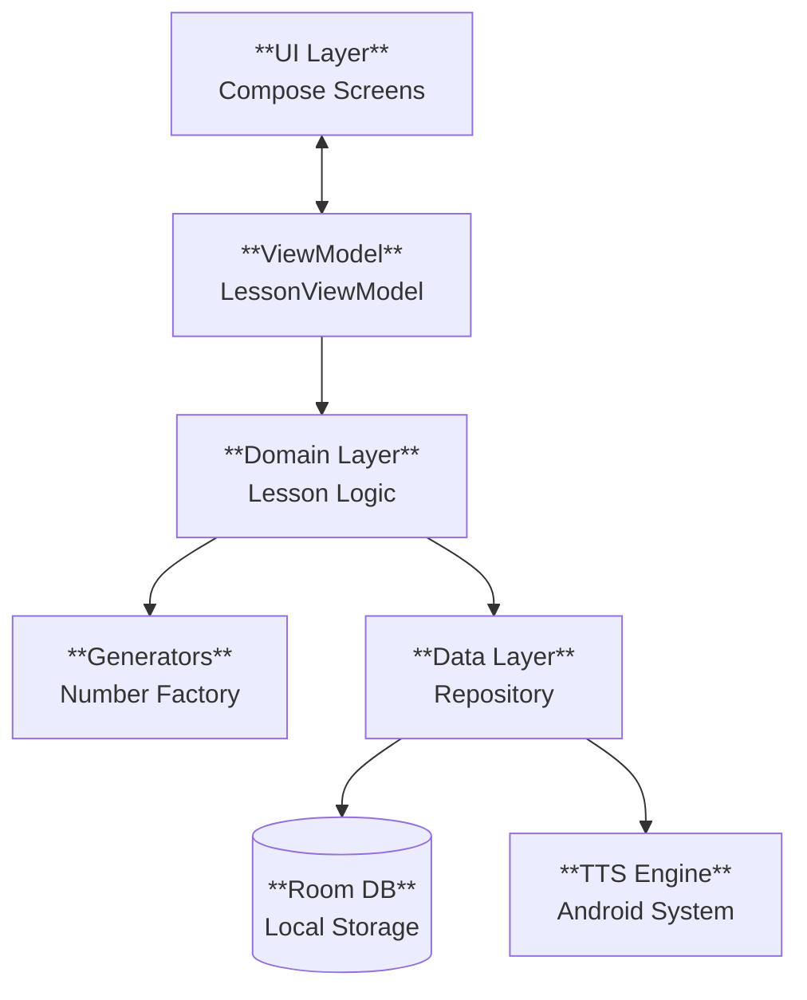

# Siffermästare Architecture Document

## Introduction

This document outlines the technical architecture for **Siffermästare**, a native Android application. The system is designed as a standalone, offline-first client using modern Android development practices.

### Change Log

| Date | Version | Description | Author |
| :--- | :--- | :--- | :--- |
| 2025-11-07 | 1.0 | Initial Architecture based on PRD v1.0. | Winston (Architect) |

## High-Level Architecture

### Architectural Style: MVVM with Clean Architecture

We will follow Google's recommended **Guide to App Architecture**, separating the app into three distinct layers:

1.  **UI Layer (Presentation):**

      * **Views:** Jetpack Compose functions (Screens, Components).
      * **State Holders:** Android `ViewModel` classes. These will hold the `LessonState` (current question, input, timer) and expose it via `StateFlow` to the UI.

2.  **Domain Layer (Business Logic):**

      * **Use Cases:** Reusable logic classes (e.g., `GenerateLessonUseCase`, `SubmitAnswerUseCase`).
      * **Generators:** The core logic for creating Swedish numbers. We will use a **Strategy Pattern** here. An interface `NumberGenerator` will have implementations for `CardinalGenerator`, `TimeGenerator`, etc.

3.  **Data Layer (Persistence & Resources):**

      * **Repositories:** `LessonRepository` (for history) and `TTSManager` (wrapper for Android TextToSpeech).
      * **Data Sources:** Room Database (SQLite) for storage; Android System for Audio.

### Key Diagram



## Tech Stack

### Cloud Infrastructure

  * **N/A:** This is an offline-first application. No cloud provider or backend services are required for the MVP.

### Technology Stack Table

| Category | Technology | Version | Purpose | Rationale |
| :--- | :--- | :--- | :--- | :--- |
| **Language** | Kotlin | 1.9.22 | Core Logic | The official, modern language for Android. |
| **UI Toolkit** | Jetpack Compose | BOM 2024.02.00 | User Interface | Declarative UI allows for faster iteration and cleaner code than legacy XML. |
| **Architecture** | Android Jetpack | Core | Lifecycle Mgmt | `ViewModel`, `Navigation`, and `Lifecycle` libraries ensure stability during config changes. |
| **Database** | Room | 2.6.1 | Local Persistence | Provides compile-time verification of SQL queries and integrates with Kotlin Flow. |
| **Dependency Injection** | Hilt | 2.50 | DI Framework | Standardizes component lifecycle (Singletons, ViewModels) and makes testing much easier. |
| **Async** | Coroutines & Flow | 1.7.3 | Concurrency | Essential for performing non-blocking database operations and TTS calls. |
| **Audio** | Android TextToSpeech | Native API | TTS Engine | Uses the device's built-in engine. Zero external dependency size. |
| **Testing** | JUnit 5 & Mockk | 5.10 / 1.13 | Unit Testing | Industry standard for mocking and assertions in Kotlin. |

## Data Models

### Domain Models (In-Memory)

These classes represent the active state of the application.

  * **`Question`**

      * **Purpose:** Represents a single challenge within a lesson.
      * **Attributes:**
          * `targetValue: String`: The correct answer (e.g., "1415"). Stored as String to handle leading zeros.
          * `spokenText: String`: The text passed to the TTS engine (e.g., "Kvart över två").
          * `visualHint: String?`: Optional hint text.

  * **`LessonSession`**

      * **Purpose:** Tracks the state of the current 10-question run.
      * **Attributes:**
          * `questions: List<Question>`: The 10 generated questions.
          * `currentIndex: Int`: 0-9.
          * `mistakeCount: Int`: Tracks attempts for the current question.
          * `questionStartTime: Long`: Timestamp when the current audio finished playing (for speed tracking).

### Persistence Models (Room Database)

These entities are saved to the device storage.

  * **`LessonResultEntity`**
      * **Purpose:** A permanent record of a completed lesson.
      * **Table Name:** `lesson_results`
      * **Attributes:**
          * `id: Long` (Primary Key, Auto-gen)
          * `timestamp: Long` (Epoch millis, when finished)
          * `moduleType: String` (e.g., "CARDINAL\_0\_100", "TIME")
          * `score: Int` (0-100, representing accuracy percentage)
          * `avgTimePerQuestionMs: Long` (Speed metric)

### Generator Strategy Pattern

  * **Interface `NumberGenerator`**
      * **Method:** `generateLesson(): List<Question>`
      * **Implementations:**
          * `CardinalGenerator(min: Int, max: Int)`
          * `OrdinalGenerator(max: Int)`
          * `TimeGenerator(is24Hour: Boolean)`

## Components & Modules

### 1\. Domain Components (Business Logic)

  * **`LessonSessionManager`**: The "brain" of the app. It holds the current `LessonSession` state.
      * *Responsibilities:* Initializes a new lesson using a Generator, validates user input, tracks the timer, calculates final stats, and emits state updates to the ViewModel.
  * **`NumberGeneratorFactory`**: A factory class that returns the correct `NumberGenerator` implementation based on the user's selection.

### 2\. Data Components (Infrastructure)

  * **`TTSManager`**: A wrapper around Android's `TextToSpeech` class.
      * *Responsibilities:* Handles initialization, language checking (Swedish), speaking text, and error callbacks. Isolates Android dependencies.
  * **`LessonRepository`**: The single source of truth for history.
      * *Responsibilities:* Writes `LessonResultEntity` to the Room DB and queries past stats.

### 3\. Source Tree Structure

```text
app/src/main/java/com/siffermastare/
├── app/                  # App-wide config
│   ├── SifferApp.kt      # Hilt Application class
│   └── di/               # Hilt Dependency Injection Modules
├── ui/                   # Presentation Layer (Jetpack Compose)
│   ├── theme/            # Color, Type, Theme.kt
│   ├── components/       # Reusable UI (Numpad, FeedbackText)
│   ├── home/             # HomeScreen & HomeViewModel
│   ├── lesson/           # ActiveLessonScreen & LessonViewModel
│   └── summary/          # SummaryScreen & SummaryViewModel
├── domain/               # Pure Kotlin Logic (No Android Dependencies)
│   ├── models/           # Question, LessonSession
│   ├── generators/       # NumberGenerator Interface & Implementations
│   └── usecases/         # GenerateLessonUseCase, SubmitAnswerUseCase
└── data/                 # Data Layer
    ├── local/            # Room Database, DAO, Entities
    ├── repository/       # LessonRepositoryImpl
    └── tts/              # TTSManager
```

## Error Handling & Testing

### Error Handling

  * **TTS Failures:** If `TextToSpeech` fails to initialize or the Swedish voice is missing, the app must not crash. Show a specific Snackbar linking to System Settings to install voice data.
  * **Persistence Errors:** Database write failures should be logged silently without blocking the user flow.

### Testing Strategy

  * **Unit Tests:** Focus on `domain/` logic.
      * Verify `CardinalGenerator` produces correct Swedish strings ("105" -\> "hundrafem").
      * Verify `LessonSessionManager` calculates `avgTimePerQuestionMs` correctly.
  * **UI Tests:** Verify Numpad interactions update the `ViewModel` state.
  * **Fake TTS:** Use a `FakeTTSManager` implementation for integration tests to verify the lesson loop without needing a physical speaker.

## Coding Standards

  * **Architecture:** Adhere strictly to MVVM. ViewModels should expose a single `UiState` data class via `StateFlow`.
  * **Compose:** Use `Composables` for all UI. No XML layouts.
  * **Concurrency:** Use Kotlin Coroutines and `viewModelScope` for all background tasks.
