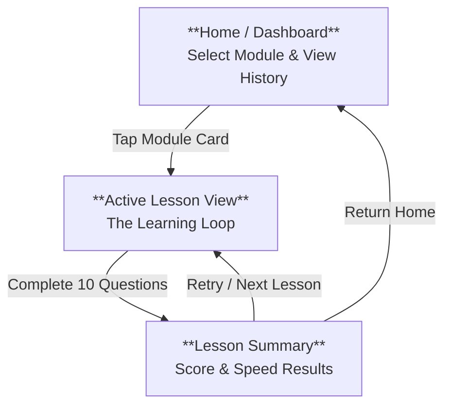
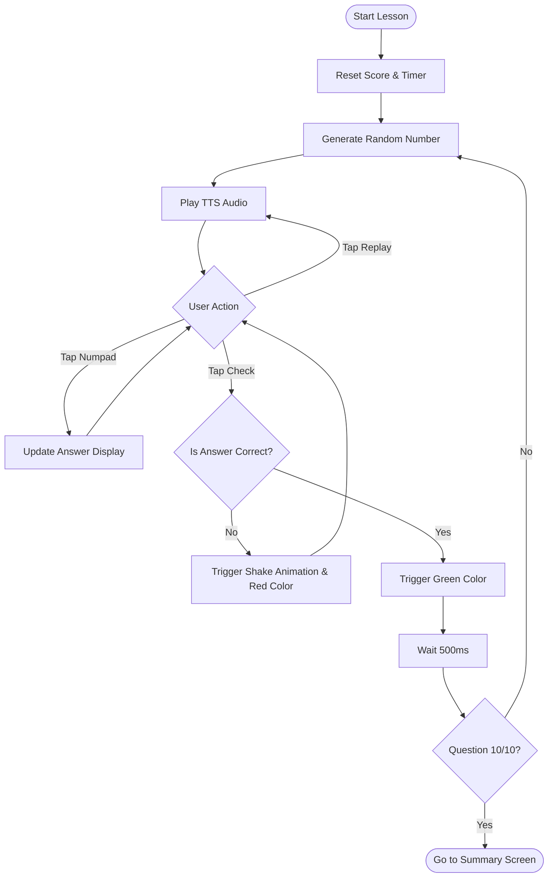

# Siffermästare UI/UX Specification

## Introduction

This document defines the user experience goals, information architecture, user flows, and visual design specifications for **Siffermästare**, the Android app for mastering Swedish numbers. It serves as the foundation for visual design and frontend development, ensuring a cohesive, native-feeling, and focused experience.

## Overall UX Goals & Principles

### Target User Personas

  * **The Dedicated Learner:** Uses the app daily to build fluency. Needs clear progress tracking and friction-free input to maintain "flow state."
  * **The Practical Expat:** Uses the app to survive daily life (dates, prices). Needs specific, high-stress format practice (e.g., *personnummer*) without fluff.

### Usability Goals

  * **Speed of Input:** The interface must minimize the time between "hearing" and "answering." The custom numpad layout is critical here.
  * **Clarity of Feedback:** Users must know *instantly* (within milliseconds) if they were right or wrong, without reading text.
  * **One-Handed Use:** The primary interaction loop should be comfortable to use with one thumb on a standard phone.

### Design Principles

1.  **Swedish Minimalist:** Clean, functional, ample whitespace. No decorative elements that distract from the numbers.
2.  **Native Android Feel:** Use Material Design 3 (Material You) shapes and motions so it feels like a high-quality system app.
3.  **Big Touch Targets:** Fitts's Law applies heavily here. The Numpad buttons must be large and impossible to miss.

## Information Architecture

### Site Map / Screen Inventory

The application consists of three primary screens arranged in a linear task flow.

[Image of Mobile App Sitemap Structure]

### Navigation Structure

  * **Primary Navigation:** Stack-based navigation (Android Navigation Component). There are no bottom tabs or side drawers in the MVP to minimize distraction.
  * **Hardware Back Button Behavior:**
      * **Home:** Exits the application.
      * **Active Lesson:** Triggers a **"Quit Session?" Confirmation Dialog**. (Prevents accidental data loss).
      * **Lesson Summary:** Returns to **Home** (It does *not* go back to the finished lesson).

### Screen Definitions

1.  **Home / Dashboard:** The entry point. Displays the "Lesson Selector" (list of available modules like Cardinal 0-20, Time, etc.) and a brief summary of recent performance.
2.  **Active Lesson View:** A full-screen immersive view where the learning happens. The system status bars (battery, time) remain visible, but no app navigation bars.
3.  **Lesson Summary:** A reward screen. Displays the Accuracy (%) and Average Speed (s). Provides two clear paths: "Play Again" (High prominence) or "Done" (Low prominence).

## User Flows

### Flow 1: The Core Learning Loop

**User Goal:** Complete a 10-question lesson by correctly identifying spoken numbers.

**Entry Point:** Tapping a Module Card on the Home Screen.
**Success Criteria:** User reaches the Summary Screen after 10 correct answers.

[Image of Mobile App User Flow Diagram]

### Edge Cases & Error Handling

  * **App Backgrounded:** If the user minimizes the app during a lesson (e.g., gets a phone call), the **Timer** should pause. The current question state (input, target number) must be preserved.
  * **Audio Failure:** If the TTS engine fails to initialize or play, show a non-intrusive "Audio Error" Snackbar with a "Retry" button. Do NOT count this as a wrong answer.
  * **Accidental Exit:** If the user swipes "Back" or taps "Close (X)", show a Confirmation Dialog: *"Quit Lesson? Progress will be lost."*
      * **Confirm:** Go to Home (Data discarded).
      * **Cancel:** Resume timer and stay on question.

**Notes:** The "Incorrect -\> Stay" logic (highlighted in the diagram) is crucial. The user *cannot* advance without entering the correct number. This forces mastery.

## Key Screen Layouts

### Screen 1: Active Lesson View (The Workspace)

**Goal:** Maximize focus on the audio and input.
**Layout Strategy:** Vertical Stack, bottom-weighted for one-handed use.

  * **Top Bar (10% Height):**

      * `Left`: "Close (X)" Icon button.
      * `Center`: "Question 3/10" Text (Typography: Body Small, Neutral Color).
      * `Right`: (Empty for MVP).

  * **Content Area (40% Height):**

      * **Replay Button:** Centered. Large (64dp+). Floating Action Button (FAB) style or prominent Circular Icon.
      * **Answer Display:** Below Replay. Large Text (H1). Displays current input (e.g., "4 5 \_").
          * *State (Empty):* Shows underline placeholder "\_".
          * *State (Error):* Text turns Red, shakes.
          * *State (Correct):* Text turns Green, checkmark icon appears next to it.

  * **Input Area (50% Height) - The "Control Center":**

      * Docked to the bottom of the screen.
      * Background: Slight surface color contrast to distinguish from content area.
      * Contains the **Custom Numpad**.

### Screen 2: The Custom Numpad Layout

**Goal:** High-speed entry without looking.
**Grid:** 3 columns x 4 rows.

[Image of numeric keypad interface layout]

| Col 1 | Col 2 | Col 3 |
| :---: | :---: | :---: |
| **1** | **2** | **3** |
| **4** | **5** | **6** |
| **7** | **8** | **9** |
| **⌫** (Back) | **0** | **✓** (Check) |

**Button Specs:**

  * **Size:** Min 64dp height. Large touch targets.
  * **Spacing:** 8dp-16dp gaps.
  * **Action Button (✓):**
      * *State (Empty Input):* Disabled/Dimmed (Prevents submitting nothing).
      * *State (Has Input):* Enabled, Primary Color (Blue).
      * *State (Success):* Turns Green during the 500ms delay.

## Visual Design System

### Branding Theme: "Swedish Functionalism"

  * **Philosophy:** Form follows function. High legibility, flat surfaces, bold accent colors.
  * **Dark Mode:** Fully supported (Essential for modern Android apps).

### Color Palette

| Role | Light Mode Hex | Dark Mode Hex | Usage |
| :--- | :--- | :--- | :--- |
| **Primary** | `#006AA7` (Sweden Blue) | `#4FA3D1` (Lighter Blue) | Action Buttons, Active States, Headers |
| **On Primary** | `#FFFFFF` | `#000000` | Text on Primary buttons |
| **Secondary** | `#FECC00` (Sweden Yellow) | `#FFD700` (Gold) | Highlights, FABs, "New" badges |
| **Background** | `#F8F9FA` (Off-White) | `#121212` (Material Dark) | Main app background |
| **Surface** | `#FFFFFF` (White) | `#1E1E1E` (Dark Grey) | Cards, Numpad Background |
| **Success** | `#198754` (Green) | `#4CAF50` (Light Green) | Correct Answer feedback |
| **Error** | `#DC3545` (Red) | `#EF5350` (Light Red) | Incorrect Answer feedback |

### Typography

  * **Font Family:** `Roboto` (Native Android default).
  * **Scale:**
      * **Display Large:** 57sp (The "Answer Display" text - Huge\!)
      * **Headline Medium:** 28sp (Lesson Headers)
      * **Label Large:** 14sp (Button Text) - Sentence Case.

### Component Styling

  * **Buttons:** Pill-shaped (Full rounded corners). Min height 56dp.
  * **Numpad Keys:**
      * Shape: Rounded Rectangle (16dp radius).
      * Elevation: Tonal elevation (no drop shadows, just color difference).
      * Ripple Effect: Standard Android ripple on tap.

## Accessibility & Adaptation

### Responsiveness Strategy

  * **Vertical Scaling:** The UI must adapt to different aspect ratios.
      * *Tall Screens (20:9):* Add whitespace between the Answer Display and Numpad.
      * *Short Screens (16:9):* Reduce the top margin; keep the Numpad full size.
  * **Small Screens:** If the device width is \< 360dp, scale down the Numpad text size from 24sp to 20sp to prevent overflow.

### Accessibility Requirements

  * **Text Scaling:** The app must support system font scaling up to 200%.
      * *Constraint:* The "Answer Display" area must grow vertically to accommodate huge text without pushing the Numpad off-screen.
  * **Screen Readers (TalkBack):**
      * The "Replay" button must have a `contentDescription="Replay Audio"`.
      * The Numpad keys must announce "One", "Two", "Backspace", "Submit".
      * When feedback appears, it must announce "Correct" or "Incorrect, try again" automatically.

## Checklist Results

| Category | Status | Critical Issues |
| :--- | :--- | :--- |
| 1. User Personas & Goals | **PASS** | Clear personas (Learner/Expat) and goals (Speed/Accuracy) defined. |
| 2. Information Architecture | **PASS** | Simple stack-based nav with clear entry/exit points. |
| 3. User Flows | **PASS** | "Incorrect -\> Stay" loop logic is explicitly defined. |
| 4. Layouts & Components | **PASS** | Custom Numpad layout specified (3x4 grid, bottom-aligned). |
| 5. Visual Design | **PASS** | "Swedish Minimalist" palette and Dark Mode support defined. |
| 6. Accessibility | **PASS** | Scaling text and TalkBack requirements included. |

## Next Steps

### Immediate Actions

1.  **Asset Creation:** Generate the app icon and splash screen using the defined palette.
2.  **Theme Implementation:** Create the Jetpack Compose `Theme.kt` file with the defined colors and typography.

### Design Handoff Checklist

  * [x] All user flows documented
  * [x] Component inventory complete (Numpad, Feedback Display)
  * [x] Accessibility requirements defined
  * [x] Responsive strategy clear
  * [x] Brand guidelines incorporated